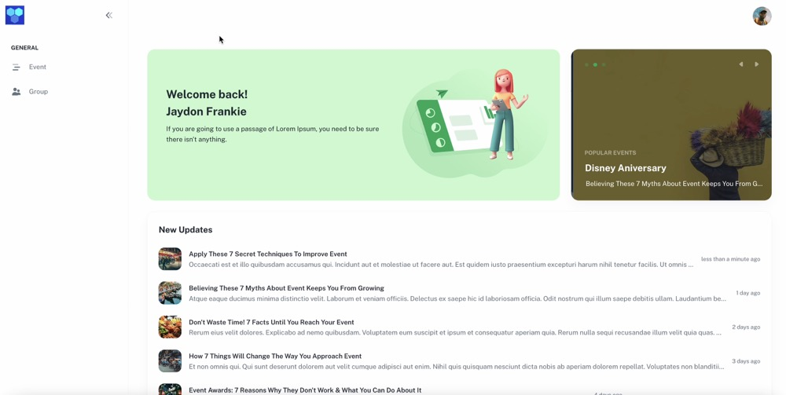
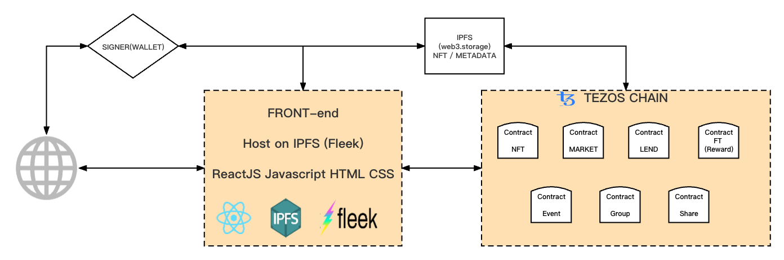

# 2022-WX-Blockchain-Fall-Hackathon-FatCow

## FatCow IO Social Trading Protocol

### Introduction
FatCow IO is a social trading protocol based on Web 3.0 and NFT utility contracts (On Tezos). We want Help People Create
Social Trading Network.
The social trading network is powered by FatCow IO social trading protocol that enables anyone to create an on-chain social trading network using Extending ERC721 .

###  Deck (Slide)
[https://github.com/wanxiang-blockchain/2022-WX-Blockchain-Fall-Hackathon-FatCow/FatCow-IO-Slide.pdf](FatCow-IO-Slide.pdf)

###  Demo Video

###  
<a href="images/demovideo.mov" target="_blank">
 Download Video Here
</a>

###  Technical Architecture

  

### Built with
- [SmartPy](https://smartpy.io/ "Solidity"): as Main Coding Language for Tezos Blockchain writing smart contract

- [ReactJs](https://reactjs.org/ "React Js"): as Main Coding Language for Creating The Front components (Front End)

- [Next.Js](https://nextjs.org/ "Next.Js"): as Main Coding Language for Creating The Front Web SDK 

- [MUI](https://mui.com/ "Mui"): as Main Coding Language for styling UI components

- [Fleek](https://fleek.co/ "Fleek"): For Dapp front store host on IPFS using Fleek

- [IPFS](https://ipfs.tech/ "IPFS"): For Storing of files

- [Web3.Storage](https://web3.storage/ "Web3 Storage"): For Storing NFT pictures and Metadata files

- [Github](https://github.com/ "Github") : For Repo Storage and source code management

- [TempleWallet](https://templewallet.com/ "templewallet") : For Tezos Blockchain Signer of Cryptocurrency Wallet

###  Requirements
	* Python 3.7+ (native install)
	* SmartPy 0.2 (native install)
    * NodeJS >= 10

### IPFS (Fleek)
- [https://ipfs.fleek.co/ipfs/QmSwF4B7ji5VWA8vLVpjMM7mjaw8Nqiau3ykUWMrFq2cyK](https://ipfs.fleek.co/ipfs/QmSwF4B7ji5VWA8vLVpjMM7mjaw8Nqiau3ykUWMrFq2cyK "ipfs") : For store the front host on IPFS

###  IDE .
	* VSCode
    * Python Ext.

### Github
https://github.com/fatcowio

### Web site
https://fatcow.io

### Twitter link
https://twitter.com/FatCowIO

### Youtube channel
https://www.youtube.com/channel/UChhkJDQQnFx7jJbAKO3C4uQ

